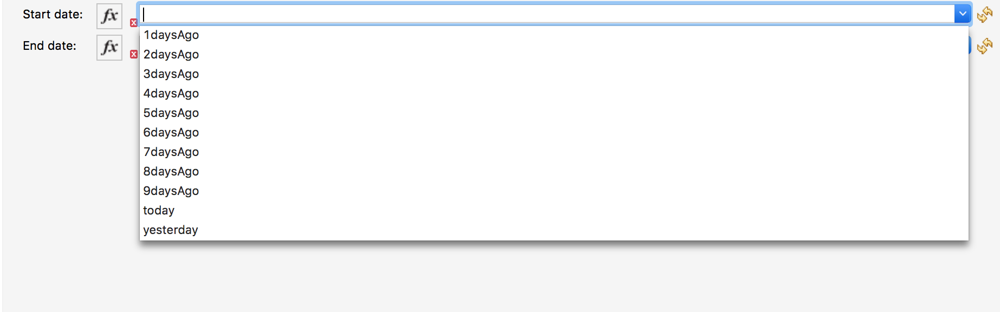
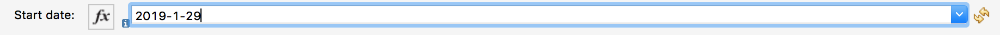

= GoogleAnalytics Connector
:keywords: anypoint studio, connector, endpoint
:imagesdir: ./images

https://www.mulesoft.com/legal/versioning-back-support-policy#anypoint-connectors[_Select_]

== Overview
The GoogleAnalytics connector was implemented using java and consuming Google Analytics core V3 API. The connector exposes  Generate Report operation.

== Prerequisites

This document assumes that you are familiar with Mule, Anypoint Connectors, Anypoint Studio, Mule concepts, elements in a Mule flow, and Global Elements.

You need login credentials to test your connection to your target resource.

For hardware and software requirements and compatibility
information, see the Connector Release Notes.

To use this connector with Maven, view the pom.xml dependency information in
the Dependency Snippets in Anypoint Exchange.

== What's New in this Connector

. Support for Mule4 has been added.

#### How to Configure OAuth2

=== Initial Steps to create  Client ID and Client Secret

. Register your application in the Google API Console.
. Authorize access to Google Analytics Data.
. Go to Google API Console Credentials Page and click  Select a project, then NEW PROJECT, and enter a name for the project, and optionally, edit the provided project ID. Click Create.
. On the Credentials page, select Create credentials, then OAuth client ID.
. You may be prompted to set a product name on the Consent screen; if so, click Configure consent screen, supply the requested information, and click Save to return to the Credentials screen.
. Once you have your Application, go to Application Details a save the values of *Client ID* and      *Client Secret*.
. Go back to *Anypoint Studio* and in a Anypoint Mule Application create a new GoogleAnalytics Connector configuration.
. Fill the *Client ID* , *Client Secret*  , Domain, port.
. To get the Application name login to your Google API console and navigate to credentials and then to OAuth Consent Screen you can find *Application name*.
. Save this Application name for usage.

+
[options="header",width="50%"]
[source,code,linenums]
|============
|Field Name   |Value
|Domain    |0.0.0.0
|Local Port    |8080
|Application Name   | xxxxxxxxxxx
|Client Id  | xxxxxxxxx
|Client Secret | xxxxxxx
|============
+ 
Save configuration. Your configuration should look like:

+
```xml
<google-analytics:config name="Google_Analytics_Config" doc:name="Google Analytics Config" doc:id="xxxxxxx" application="xxxxxxx">
		<google-analytics:connection clientId="xxxxxxxxx" clientSecret="xxxxxxxx" domain="localhost" port="8080" applicationName="xxxxxxx"/>
	</google-analytics:config>
```
+
. To authorize a user in your Mule application, you should create a flow like the following calling the "authorize" operation:
+
```xml
<http:listener-config name="HTTP_Listener_config" doc:name="HTTP Listener config" doc:id="xxxxx" >
		<http:listener-connection host="localhost" port="8081" />
	</http:listener-config>
	<flow name="test2Flow" doc:id="xxxxxxxxxxx" >
		<http:listener doc:name="Listener" doc:id="xxxxxxxxxxx" config-ref="HTTP_Listener_config" path="/test"/>
		<google-analytics:generate-report doc:name="Generate report" doc:id="xxxxxxxxxxxxx" config-ref="Google_Analytics_Config"/>
		
</flow>
```
 Then in a browser enter to http://localhost:8081/test and authorize your user.

=== See Also

 * For more information about the Google Analytics API Authorization : https://developers.google.com/analytics/devguides/reporting/core/v3/authorization
 
 
= Operations:

== Generate report:
Generate report is core operation of the connector which is responsible for getting google analytics data .

=== Input Parameters for generate report:

Input Parameters for generate report:

. *Id* : String(required)
The unique table ID is the Analytics view (profile) ID for which the query will retrieve the data.

==== Find your Google Analytics ID


[source,code,linenums]
----
. Create an Google Analytics Account.
. Sign in to your Account and click Admin
. Select an account from the menu in the ACCOUNT column.
. Select a property from the menu in the PROPERTY column.
. Under PROPERTY, click Tracking Info > Tracking Code. Your Google Analytics ID is displayed at the top of the page.
----


 . *start-date* : String(required)
Start date for fetching Analytics data. Requests can specify a start date formatted as YYYY-MM-DD, or as a relative date (e.g., today, yesterday, or NdaysAgo where N is a positive integer).

Values must match [0-9]{4}-[0-9]{2}-[0-9]{2}|today|yesterday|[0-9]+(daysAgo).

The earliest valid start-date is 2005-01-01. There is no upper limit restriction for a start-date.
Relative dates are always relative to the current date at the time of the query and are based on the timezone of the view (profile) specified in the query.

Google analytics connector has a facility to select value from the dropdown list or user can give the date manually according to the matching pattern.

+

+
+

+

. *End-date* : String(required)

All Analytics data requests must specify a date range. If you do not include start-date and end-date parameters in the request, the server returns an error. Date values can be for a specific date by using the pattern YYYY-MM-DD or relative by using today, yesterday, or the NdaysAgo pattern. Values must match [0-9]{4}-[0-9]{2}-[0-9]{2}|today|yesterday|[0-9]+(daysAgo).
The earliest valid end-date is 2005-01-01. There is no upper limit restriction for an end-date.
Relative dates are always relative to the current date at the time of the query and are based on the timezone of the view (profile) specified in the query.

Google analytics connector has a facility to select value from the dropdown list or user can give the date manually according to the matching pattern.


. *Metrics* : String(required)
Metrics are the actual numbers google analytics measures from your website . whether thats number of sessions , time on page or the bounce rate.

The aggregated statistics for user activity to your site, such as clicks or pageviews. If a query has no dimensions parameter, the returned metrics provide aggregate values for the requested date range, such as overall pageviews or total bounces. However, when dimensions are requested, values are segmented by dimension value. For example, ga:pageviews requested with ga:country returns the total pageviews per country. When requesting metrics, keep in mind.

. Any request must supply at least one metric; a request cannot consist only of dimensions.
. You can supply a maximum of 10 metrics for any query.
. Most combinations of metrics from multiple categories can be used together, provided no   dimensions are specified

To know more about metrics access the link : https://developers.google.com/analytics/devguides/reporting/core/dimsmets[metrics parameters]

==== Building metrics query

. Click on the plus sign to build the query
+
image::metrics_1.png
+
. Select metrics values from the dropdown list
+
image::metrics_2.png
+
. Save the Selected values to build the query
+
image::metrics_3.png
+
. *Dimensions* : String(optional)

A metrics are actual measurements produced on your website, dimensions are rules in which you can compile those measurements and convert them into actual, readable number relevant to your business.

To know more about Dimensions access the link : https://developers.google.com/analytics/devguides/reporting/core/dimsmets[Dimensions parameters] 

==== Building dimension query
. Building dimension query is similar to building metrics query adding the required values from the dropdown.
+
image::dimension.png
+

. *Sort* : String(optional)

A list of dimensions and metrics indicating the sorting order and sorting direction for the returned data.
+
image::sort.png
+
. can be sorted either in ascending order or descending order. By default it has ascending order

. *Filters* : String(optional)

The filters query string parameter restricts the data returned from your request. To use the filters parameter, supply a dimension or metric on which to filter, followed by the filter expression.

==== Building filter query
. To build a filter query click on the plus sign it opens a new window

+
image::filter_1.png
+

. key parameters shows list of available filter metrics and dimensions values

+
image::filter_2.png
+

. Operator parameter shows list of available operator in metrics like greaterThan or lessThan ..etc as shown in the table below 
+
[options="header",width="50%"]
[source,code,linenums]
|============
|Operator  |Description
|==   | Equal to or exact match
|!=	  | Not equal to or is not an exact match
|<   | Less than
|<= | Less than or equal to
|> | Greater Than
|>= | Greater Than or equal to
| =@ | Contains substring
| !@ | Does not contain substring
|  =~ | Contains a match for regular expression
|!~ | Does not contain a match for regular expression
|============
+
+
image::filter_3.png
+

. Value parameter is user defined and show be given by user and can be of integer or String.
+
 example: 1, United States
+
. To use multiple filters we can combine them  using AND , OR operation.
+
image::filter_4.png
+

. *Segment* : String(optional)

A segment is a subset of your Analytics data. For example, of your entire set of users, one segment might be users from a particular country or city. Another segment might be users who purchase a particular line of products or who visit a specific part of your site.

Segments let you isolate and analyze those subsets of data, so you can examine and respond to the component trends in your business.

==== Building segment query

. To build a filter query click on the plus sign it opens a new window

+
image::segment_1.png
+
. Segment key gives user to build an query using sessions or users condition.
+
image::segment_2.png
+
. Segment type gives an option to select one or more conditions and/or sequences once you determine to use segment users or sessions.
+
image::segement_3.png
+
. Segment filter gives list of dimensions and metrics values to choose from dropdown list.
+
image::segment-4.png
+
. Segment Operator helps in choosing required operations to the segments.
 the list of operations available are shown below 
 
 +
[options="header",width="50%"]
[source,code,linenums]
|============
|Operator  |Description
|==   | Equal to or exact match
|!=	  | Not equal to or is not an exact match
|<   | Less than
|<= | Less than or equal to
|> | Greater Than
|>= | Greater Than or equal to
| <> | Between (value is between the given range)
| [] | In list (value is one of the listed values)
| =@ | Contains substring
| !@ | Does not contain substring
|  =~ | Contains a match for regular expression
|!~ | Does not contain a match for regular expression
|============
+ 
. Segment value can be of type integer or string which is given by user.

example: Chrome, 2 ...etc 

the complete query looks like 
+
image::segment_5.png
+

. *SamplingLevel*: String(optional)

The desired sampling levels. user can select from the following.
  
+
[options="header",width="50%"]
[source,code,linenums]
|============
| DEFAULT   |  Returns response with a sample size that balances speed and accuracy.
| FASTER    | Returns a fast response with a smaller sample size.
| HIGHER_PRECISION | Returns a more accurate response using a large sample size, but this may     result in the response being slower.
|============
+ 


Start-index: Integer(optional)

The first row of data to retrieve, starting at 1. Use this parameter as a pagination mechanism along with the max-results parameter.

Start-index: Integer(optional)

The first row of data to retrieve, starting at 1. Use this parameter as a pagination mechanism along with the max-results parameter.


Max-results: Integer(optional)

The maximum number of rows to include in the response.


Output: String(optional)

The desired output type for the Analytics data returned in the response. Acceptable values are json and dataTable(Default: json).

== Use Case: Studio

=== Create a Keyspace
. Create a new *Mule Project* in Anypoint Studio and fill in the Google Analytics OAuth 2.0  *credentials* in `src/main/resources/mule-app.properties`.

+
image::test_flow.png
+
+
[source,code,linenums]
----
config.clientID=<CLIENT_ID>
config.clientSECRET=<CLIENT_SECRET>
config.domain=<DOMAIN>
config.localhost=<LOCALHOST>
config.application_name=<APPLICATION_NAME>
----
+
. Drag an *HTTP* connector onto the canvas and leave the default values for Host and Port and set the path to `/test`.
+
. In the general tab fill the required query parameters by using valid Google Analytics ID , start-date, end-date and build Metrics Query.

. In the Advance tab you can use optional query parameters such as sorting, filter, dimensions , segments to get more precise data.


+
. Run the app. In a browser, use the following URL 
+
`http://localhost:8081/test`

== Use Case: XML


[source,code]
----
<?xml version="1.0" encoding="UTF-8"?>

<mule xmlns:slack="http://www.mulesoft.org/schema/mule/slack" xmlns:google-analytics="http://www.mulesoft.org/schema/mule/google-analytics"
	xmlns:http="http://www.mulesoft.org/schema/mule/http"
	xmlns="http://www.mulesoft.org/schema/mule/core" xmlns:doc="http://www.mulesoft.org/schema/mule/documentation" xmlns:xsi="http://www.w3.org/2001/XMLSchema-instance" xsi:schemaLocation="http://www.mulesoft.org/schema/mule/core http://www.mulesoft.org/schema/mule/core/current/mule.xsd
http://www.mulesoft.org/schema/mule/http http://www.mulesoft.org/schema/mule/http/current/mule-http.xsd
http://www.mulesoft.org/schema/mule/google-analytics http://www.mulesoft.org/schema/mule/google-analytics/current/mule-google-analytics.xsd
http://www.mulesoft.org/schema/mule/slack http://www.mulesoft.org/schema/mule/slack/current/mule-slack.xsd">
	<google-analytics:config name="Google_Analytics_Config" doc:name="Google Analytics Config" doc:id="0b67d9b3-57e8-4137-8b2c-0fb567ff191c" application="Hello Analytics">
		<google-analytics:connection clientId="${config.clientID}" clientSecret="${config.clientSECRET}" domain="${config.domain}" port="${config.localhost}" applicationName="${config.application_name}"/>
	</google-analytics:config>
	<http:listener-config name="HTTP_Listener_config" doc:name="HTTP Listener config" doc:id="d2b90013-2b13-4f61-9244-bd456d00a40c" >
		<http:listener-connection host="localhost" port="8081" />
	</http:listener-config>
	<flow name="test2Flow" doc:id="82c91b53-03c2-44e5-a7f0-81415a7bc613" >
		<http:listener doc:name="Listener" doc:id="18d3e152-42a8-4239-8124-583381b94a0e" config-ref="HTTP_Listener_config" path="/test"/>
		<google-analytics:generate-report doc:name="Generate report" doc:id="afa984e1-da6a-4875-b09e-7b7520a8bf66" config-ref="Google_Analytics_Config" profileId="xxxxx" startDate="2019-1-29" endDate="today">
			<google-analytics:metrix-parameters >
				<google-analytics:metrics-parameter value="Sessions" />
				<google-analytics:metrics-parameter value="Bounces" />
			</google-analytics:metrix-parameters>
			<google-analytics:dimension-parameters >
				<google-analytics:dimension-parameter value="Browser" />
				<google-analytics:dimension-parameter value="City" />
			</google-analytics:dimension-parameters>
			<google-analytics:sort-parameters >
				<google-analytics:sortparms >
					<google-analytics:sort-parameter-type sortparamValue="Browser" sortOrder="ASCENDING" />
				</google-analytics:sortparms>
			</google-analytics:sort-parameters>
			<google-analytics:filter-parameter >
				<google-analytics:filter-params >
					<google-analytics:filter-parameter-type key="Sessions" operator="GreaterThan" value="1" operation="AND" />
					<google-analytics:filter-parameter-type key="Country" operator="Equals" value="United States" operation="AND" />
				</google-analytics:filter-params>
			</google-analytics:filter-parameter>
			<google-analytics:segmentparameter />
		</google-analytics:generate-report>
		
	</flow>
</mule>

----

=== Useful Links

* Reference for : https://developers.google.com/analytics/devguides/reporting/core/v3/[Google Analytics API]
* To contact team : https://ksquareinc.com/contact/[Ksquare].


  
